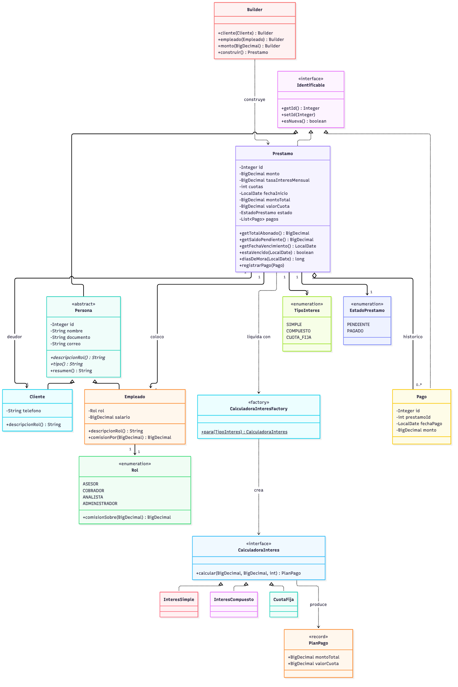
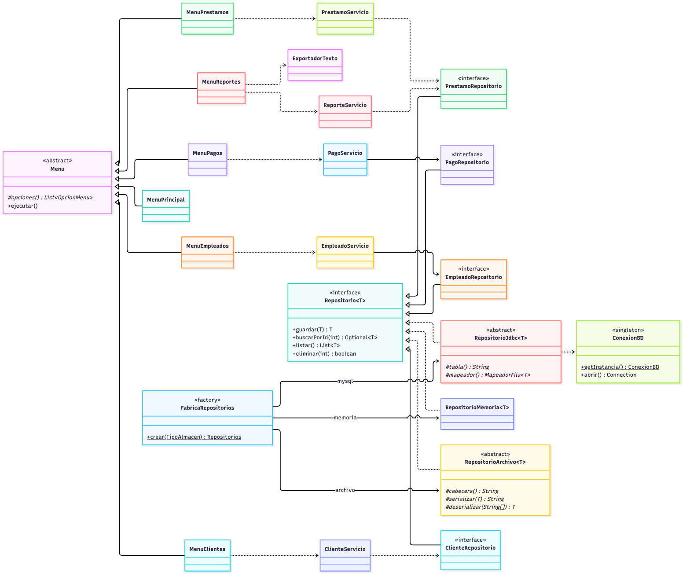

# CrediYa S.A.S. — Sistema de Cobros de Cartera

Aplicación de consola en Java para administrar los préstamos personales de CrediYa S.A.S.:
empleados, clientes, créditos, abonos y reportes de cartera, con persistencia en **MySQL
(JDBC)** y en **archivos de texto**.

Reemplaza las hojas de cálculo con las que la empresa venía trabajando y agrega lo que una
hoja de cálculo no puede dar: validación de los datos al momento de capturarlos, cálculo
automático de intereses, control de que nadie abone más de lo que debe y reportes de mora
calculados sobre la información real.

---

## Tabla de contenido

1. [Qué hace el sistema](#qué-hace-el-sistema)
2. [Cómo ejecutarlo](#cómo-ejecutarlo)
3. [Base de datos](#base-de-datos)
4. [Estructura del proyecto](#estructura-del-proyecto)
5. [Diagramas](#diagramas)
6. [Decisiones de diseño](#decisiones-de-diseño)
7. [Ejemplos de uso](#ejemplos-de-uso)
8. [Pruebas](#pruebas)
9. [Alcance y limitaciones conocidas](#alcance-y-limitaciones-conocidas)

---

## Qué hace el sistema

| Módulo | Funciones |
|---|---|
| **Empleados** | Registrar, listar, buscar por documento, filtrar por rol, actualizar salario, ver nómina y distribución por rol. |
| **Clientes** | Registrar, listar, buscar por documento o por nombre parcial, consultar la cartera completa de un cliente. |
| **Préstamos** | Simular un crédito sin guardarlo, otorgarlo asociando cliente y empleado, consultar el detalle con su plan de pagos, cambiar el estado, ver lo colocado por cada empleado. |
| **Pagos** | Registrar abonos, ver el histórico de un préstamo, listar los últimos pagos, ver el recaudo mes a mes. |
| **Reportes** | Resumen de cartera, préstamos activos, préstamos vencidos, clientes morosos, mayores deudores, productividad y comisiones por empleado, filtro por rango de monto, conteo por estado y exportación a archivos de texto. |

El monto total y el valor de la cuota **no se digitan**: los calcula el sistema a partir del
capital, la tasa mensual, el número de cuotas y la modalidad elegida (interés simple,
interés compuesto o cuota fija del sistema francés).

---

## Cómo ejecutarlo

**Requisitos:** JDK 17 o superior y Maven 3.8+. MySQL 8 solo si se quiere usar ese almacén.

```bash
git clone https://github.com/isnowyy/crediya.git
cd crediya
./run.sh
```

El script compila y arranca. También se puede forzar el almacén:

```bash
./run.sh memoria    # no necesita nada instalado: ideal para una demostración rápida
./run.sh archivo    # trabaja sobre los .txt de datos/
./run.sh mysql      # trabaja contra la base de datos
```

Equivalente sin el script:

```bash
mvn compile
mvn exec:java
```

Para generar un único ejecutable que ya trae dentro el driver de MySQL:

```bash
mvn package
java -jar target/crediya-jar-with-dependencies.jar
```

### Si MySQL no está disponible

El programa no se cae: avisa qué revisar y ofrece continuar con archivos de texto.

```
  [!] No se pudo conectar con MySQL.
  Revise que:
    1. El servidor este encendido          (brew services start mysql)
    2. Exista la base de datos             (mysql -u root -p < sql/crediya_db.sql)
    3. La clave de crediya.local.properties sea la correcta

  Desea continuar con archivos de texto? (s/n):
```

---

## Base de datos

### 1. Crear el esquema y los datos de ejemplo

```bash
mysql -u root -p < sql/crediya_db.sql
```

### 2. Crear el usuario de la aplicación y configurar la conexión

La aplicación **nunca** se conecta como `root`: usa una cuenta que solo puede leer y escribir
en `crediya_db`.

En `sql/crear_usuario.sql`, `CAMBIE_ESTA_CLAVE` es un marcador de posición. **No ejecute ese
archivo tal cual**, o la cuenta quedará con una clave que está publicada en este repositorio.
Tampoco lo edite: está versionado, y su clave real terminaría en un archivo que git vigila.

Este comando hace todo sin tocar la plantilla. Pide primero la clave que usted elija para
`crediya_app` (no se ve al escribirla) y después la de `root`:

```bash
printf 'Clave para crediya_app: '; stty -echo; read CLAVE; stty echo; echo; sed "s/CAMBIE_ESTA_CLAVE/$CLAVE/" sql/crear_usuario.sql | mysql -u root -p && printf 'crediya.db.clave=%s\n' "$CLAVE" > crediya.local.properties && unset CLAVE && echo OK
```

Use una clave de letras, dígitos y guiones bajos. Caracteres como `/`, `&`, `|` o comillas
confunden a `sed` o al propio cliente de MySQL.

> El apagado del eco se hace con `stty` y no con `read -s -p` porque esa última es sintaxis
> de bash: en zsh, que es el shell por defecto de macOS, `-p` significa "leer de un
> coproceso" y el comando falla. Así funciona en los dos.

`crediya.local.properties` está en `.gitignore`, así que la clave nunca sale de su máquina.
No hace falta nada más: la URL, el usuario y el modo ya vienen configurados por defecto en
`src/main/resources/crediya.properties`.

El script es idempotente: si se equivocó, vuelva a correr los tres comandos con otra clave y
la actualiza.

Como alternativa, las variables de entorno tienen prioridad sobre el archivo:

```bash
export CREDIYA_DB_CLAVE=la_clave_que_eligio
```

### Cambios frente al script guía

El enunciado permite ajustar el esquema. Lo que se modificó y por qué:

| Cambio | Razón |
|---|---|
| `tipo_interes VARCHAR(20)` en `prestamos` | Sin esta columna, al releer un préstamo no se puede reconstruir su monto total ni su cuota: no se sabría con qué fórmula se liquidó. |
| `NOT NULL` y `UNIQUE` en documentos y correos | El documento es la llave natural de una persona. Dejar que la base lo garantice protege los datos aunque la aplicación falle. |
| `CHECK` en montos, tasas, cuotas y estados | Un monto negativo o un estado inventado no deben poder existir, ni siquiera entrando por consola SQL. |
| `FOREIGN KEY ... ON DELETE RESTRICT` en `prestamos` | La cartera es información contable: no se borra un cliente que tiene créditos. |
| `FOREIGN KEY ... ON DELETE CASCADE` en `pagos` | Un abono no significa nada sin su préstamo. |
| Índices en `cliente_id`, `empleado_id` y `estado` | Son exactamente las columnas por las que filtra el módulo de reportes. |
| Vista `v_saldo_prestamos` | Permite verificar desde SQL los mismos saldos que la aplicación calcula en Java. Útil durante la sustentación. |

---

## Estructura del proyecto

```
crediya/
├── pom.xml                      Maven: driver de MySQL, JUnit 5, empaquetado
├── run.sh                       Compila y ejecuta
├── sql/
│   ├── crediya_db.sql           Esquema + datos de ejemplo
│   └── crear_usuario.sql        Usuario de aplicación (plantilla, sin clave real)
├── datos/                       Archivos de texto generados por el sistema
│   ├── empleados.txt  clientes.txt  prestamos.txt  pagos.txt
│   └── reporte-cartera.txt
├── docs/
│   ├── diagrama-clases.mmd      UML del dominio (Mermaid)
│   ├── diagrama-arquitectura.mmd UML de capas y repositorios
│   └── img/                     Los dos diagramas en PNG
└── src/
    ├── main/java/com/crediya/
    │   ├── app/                 Main, ContextoAplicacion, DatosDemo
    │   │   └── menu/            Menu (base) y los seis menús concretos
    │   ├── modelo/              Persona, Empleado, Cliente, Prestamo, Pago, enums
    │   │   └── interes/         Estrategias de liquidación + fábrica
    │   ├── repositorio/         Interfaces (la frontera con la tecnología)
    │   │   ├── jdbc/            Implementación MySQL + ConexionBD
    │   │   ├── archivo/         Implementación en texto plano
    │   │   └── memoria/         Implementación volátil (demos y pruebas)
    │   ├── servicio/            Reglas de negocio y reportes
    │   │   └── reporte/         DTOs de los reportes (records)
    │   ├── config/              Configuración y fábrica de repositorios
    │   ├── excepcion/           Jerarquía propia de excepciones
    │   └── util/                Consola, Dinero, Validaciones, Bitacora
    └── test/java/com/crediya/   59 pruebas unitarias con JUnit 5
```

---

## Diagramas

### Clases del dominio



### Capas y patrón Repositorio



Las fuentes están en `docs/*.mmd` y se pueden editar en [mermaid.live](https://mermaid.live).

---

## Decisiones de diseño

### Por qué el modelo es rico y no anémico

`Prestamo` no es una bolsa de atributos con `get` y `set`. Es el dueño de sus pagos y el que
decide si un abono es válido:

```java
public void registrarPago(Pago pago) {
    if (estado == EstadoPrestamo.PAGADO) { ... }
    if (pago.getMonto().compareTo(getSaldoPendiente()) > 0) { ... }
    pagos.add(pago);
    if (getSaldoPendiente().signum() == 0) {
        estado = EstadoPrestamo.PAGADO;
    }
}
```

Como esa regla vive dentro del objeto, **ninguna** capa puede saltársela: ni la consola, ni
un servicio, ni los datos de demostración. `PagoServicio` se limita a traer el préstamo,
pasarle el abono y persistir el resultado.

### Por qué `BigDecimal` y nunca `double`

Con punto flotante, `0.1 + 0.2` no da `0.3`. En una cartera eso se traduce en saldos
descuadrados por centavos que no cierran nunca. Todo el dinero del sistema pasa por
`util/Dinero`, que fija dos decimales y redondeo `HALF_UP`, que es la convención contable.

### Por qué los estados "vencido" y "moroso" no existen en la base

`EstadoPrestamo` solo tiene `PENDIENTE` y `PAGADO`. Vencido y moroso no son estados que
alguien escriba, sino conclusiones que salen de comparar la fecha de vencimiento con el día
de hoy y mirar el saldo. Guardarlos obligaría a un proceso que los recalcule cada noche y a
vivir con el riesgo de que queden desactualizados.

### Principios SOLID

| Principio | Dónde se ve |
|---|---|
| **S** — Responsabilidad única | `Prestamo` liquida y controla su saldo; `PrestamoServicio` valida contra el resto del sistema; `RepositorioJdbc` solo habla con la base; `Consola` solo lee y escribe por pantalla. Ninguna clase hace dos de esas cosas. |
| **O** — Abierto/cerrado | Agregar una modalidad de crédito es escribir una clase que implemente `CalculadoraInteres` y registrarla en la fábrica. No se toca `Prestamo` ni ningún servicio. |
| **L** — Sustitución de Liskov | Donde se espera una `Persona` funcionan igual `Empleado` y `Cliente`: ninguno rompe el contrato de `descripcionRol()`. Donde se espera un `Repositorio<T>` funcionan las tres implementaciones. |
| **I** — Segregación de interfaces | `Identificable` tiene dos métodos. `Repositorio<T>` tiene cuatro. Cada repositorio concreto agrega solo lo suyo (`buscarPorDocumento`, `buscarPorPrestamo`). Nadie implementa métodos que no usa. |
| **D** — Inversión de dependencias | Los servicios reciben interfaces por constructor, nunca clases concretas. Las pruebas unitarias corren contra repositorios en memoria **sin cambiar una línea del servicio**: esa es la prueba de que el principio se cumple de verdad y no solo en el papel. |

### Patrones aplicados

| Patrón | Clase | Qué problema resuelve |
|---|---|---|
| **Repository (DAO)** | `Repositorio<T>` y sus implementaciones | Aísla el dominio de la tecnología de almacenamiento. |
| **Template Method** | `RepositorioArchivo<T>`, `RepositorioJdbc<T>`, `Menu` | El algoritmo común se escribe una vez; las subclases llenan los huecos. Sin esto, los cuatro repositorios de archivo serían el mismo código copiado cuatro veces. |
| **Strategy** | `CalculadoraInteres` + `InteresSimple`, `InteresCompuesto`, `CuotaFija` | Tres fórmulas intercambiables sin condicionales repartidos por el código. |
| **Factory** | `CalculadoraInteresFactory`, `FabricaRepositorios` | Centraliza la decisión de qué implementación concreta se usa. `FabricaRepositorios` es el **único** lugar del proyecto donde se nombran las clases `Jdbc*`, `Archivo*` y `Memoria*`. |
| **Singleton** | `ConexionBD`, `Configuracion` | Los datos de conexión se leen una vez y todos los repositorios usan los mismos. Implementado con el modismo de la clase interna, que la JVM garantiza seguro entre hilos sin `synchronized`. |
| **Builder** | `Prestamo.Builder` | Nueve parámetros, varios del mismo tipo y varios opcionales. Un constructor así se presta para invertir argumentos sin que el compilador avise. |
| **DTO** | `ClienteMoroso`, `ProductividadEmpleado`, `ResumenCartera` | Transportan el resultado de un reporte sin ensuciar el modelo con clases que solo sirven para imprimir. |
| **Inyección de dependencias** | `ContextoAplicacion` | Único lugar donde se decide quién depende de quién. |

### Manejo de excepciones

```
CrediYaException (RuntimeException)
├── ValidacionException          formato inválido: correo sin arroba, salario negativo
├── ReglaNegocioException        válido por separado, prohibido por el negocio
├── RecursoNoEncontradoException se pidió algo por id y no existe
└── PersistenciaException        falla al leer o escribir, envolviendo SQLException/IOException
```

Dos decisiones:

1. **Son excepciones no verificadas.** Ninguna capa intermedia sabría recuperarse de ellas;
   obligarlas a declarar `throws` solo ensuciaría las firmas.
2. **Se atrapan en un solo lugar:** `Menu.ejecutarConRed()`. El usuario ve una línea
   explicativa, la traza completa queda en `datos/bitacora.log` y el menú vuelve a
   aparecer. Un dato mal digitado nunca tumba el programa.

`PersistenciaException` traduce `SQLException` e `IOException` a un tipo propio. Es lo que
permite que los servicios no queden atados a JDBC.

---

## Ejemplos de uso

### Simular un crédito antes de otorgarlo

```
-- Simulacion de credito
  Monto a prestar: 5000000
  Interes mensual (%): 2
  Numero de cuotas: 12

    1) SIMPLE         Interes simple sobre el capital
    2) COMPUESTO      Interes compuesto capitalizado mes a mes
    3) CUOTA_FIJA     Amortizacion con cuota fija (sistema frances)
  Modalidad: 1

  Capital      : $ 5.000.000,00
  Monto total  : $ 6.200.000,00
  Intereses    : $ 1.200.000,00
  Cuota mensual: $ 516.666,67  x 12 meses
  [i] Simulacion informativa: no quedo nada registrado.
```

### Una regla de negocio en acción

```
  [!] Marta Quintero tiene 1 prestamo(s) vencido(s); el mas antiguo lleva 92 dias
      de mora. No se puede otorgar credito nuevo.
```

### Reporte de cartera

```
-- Resumen de cartera al 2026-10-01
Prestamos registrados : 6
  activos             : 5
  pagados             : 1
  vencidos            : 2
Capital colocado      : $ 31.500.000,00
Saldo por cobrar      : $ 33.280.151,87
Total recaudado       : $ 5.844.666,67
Indice de mora        : 40.00 %
```

### Clientes morosos

```
-- Clientes morosos
   1. Marta Quintero    doc. 63301122    1 vencido(s)  deuda $ 1.916.666,67  mora  92 dias
   2. Sofia Carreno     doc. 1101223344  1 vencido(s)  deuda $ 1.488.263,22  mora 183 dias
```

### Formato de los archivos de texto

```
# id;nombre;documento;rol;correo;salario
1;Ana Maria Gomez;1098765432;ASESOR;ana.gomez@crediya.co;3200000.00
2;Carlos Pena Ruiz;91234567;COBRADOR;carlos.pena@crediya.co;2400000.00
```

Valores separados por punto y coma, UTF-8 y una primera línea que documenta las columnas.
Se abre en Excel y se revisa a simple vista.

---

## Pruebas

```bash
mvn test
```

**59 pruebas** con JUnit 5:

| Clase | Qué verifica |
|---|---|
| `CalculadoraInteresTest` | Las tres fórmulas contra valores calculados a mano; que el compuesto supere al simple; que la cuota fija no divida por cero con tasa 0. |
| `PrestamoTest` | Saldo, paso automático a `PAGADO`, rechazo de abonos excesivos o ajenos, detección de mora, historial inmodificable. |
| `PrestamoServicioTest` | Creación, cliente inexistente, negación de crédito a morosos, que la simulación no persista. |
| `PagoServicioTest` | Abono guardado, cancelación del préstamo, que un abono rechazado no quede registrado, agrupación del recaudo por mes. |
| `ReporteServicioTest` | Activos, vencidos, morosos, comisiones y los filtros por lambda. |
| `RepositorioArchivoTest` | Viaje de ida y vuelta a disco, numeración, actualización sin duplicar, reconstrucción de relaciones, limpieza del separador. |
| `ValidacionesTest` | Correos, documentos, montos y porcentajes, con `@ParameterizedTest`. |

Dos criterios que se siguieron en todas:

- **Ninguna depende del reloj.** Los reportes reciben la fecha de referencia como parámetro;
  una prueba atada a `LocalDate.now()` pasa el día que se escribe y falla sola meses después.
- **Ninguna necesita MySQL ni toca los archivos reales.** Usan el almacén en memoria o una
  carpeta temporal (`@TempDir`). Eso las hace rápidas y repetibles.

---

## Alcance y limitaciones conocidas

Vale más decirlas que fingir que no existen:

- **El abono y la actualización del préstamo son dos escrituras separadas, sin transacción.**
  Para una aplicación de consola de un solo usuario el riesgo es despreciable; un sistema
  multiusuario necesitaría una unidad de trabajo que las agrupe.
- **Los repositorios de archivo leen y reescriben el archivo completo en cada operación.**
  Para los volúmenes del ejercicio es intrascendente y mantiene el código legible; para
  volúmenes reales está la implementación JDBC.
- **No hay pool de conexiones.** Cada operación abre y cierra la suya con
  try-with-resources. Un pool aquí sería complejidad sin beneficio.
- **No hay autenticación de usuarios.** El enunciado no la pide y agregarla sin un modelo de
  permisos real daría una falsa sensación de seguridad.

---

## Licencia

Proyecto académico. Uso libre con fines educativos.
